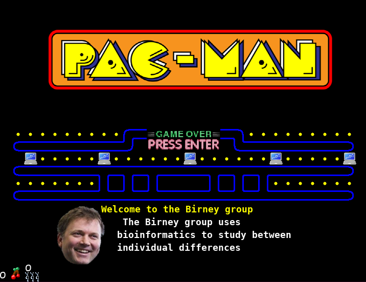
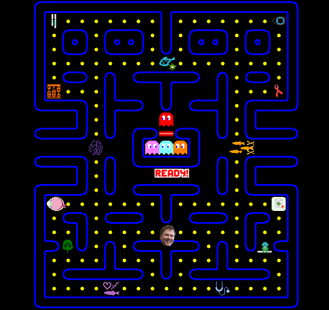

Welcome to Birney's own Pacman game!





# Acknowledgment
Source from Pacman by David Reilly, with contributions by Andy Sommerville (2007)

Github project page:
https://github.com/greyblue9/pacman-python

Personal project page:
http://pinproject.com/pacman/pacman.htm

# Installation

**Requirements: Python 3.x**

## Windows
Simply double-click on the launch.bat script

## Linux and Mac

### First way
* Open a terminal (```Ctrl+Alt+T``` for Linux, ```Cmd+Space``` and type ```terminal``` for Mac)
* manually install the pygame dependency: ```pip install pygame```
* navigate to the main folder of the game (something like ```cd ~/Downloads/pacman-python-master```)
* then you can launch the game: ```python pacman.py```

### Second way
* Open a terminal (```Ctrl+Alt+T``` for Linux, ```Cmd+Space``` and type ```terminal``` for Mac)
* navigate to the main folder of the game (something like ```cd ~/Downloads/pacman-python-master```)
* make the launch.sh script executable: ```chmod u+x launch.sh```
* launch the game through the script: ```./launch.sh```

### Third way
* Open a terminal (```Ctrl+Alt+T``` for Linux, ```Cmd+Space``` and type ```terminal``` for Mac)
* navigate to the main folder of the game (something like ```cd ~/Downloads/pacman-python-master```)
* install the dependencies: ```python setup.py install```
* then you can launch the game: ```python pacman.py```

*Fanny Defranoux - 2021*
